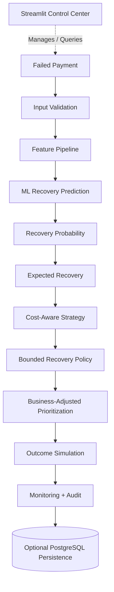
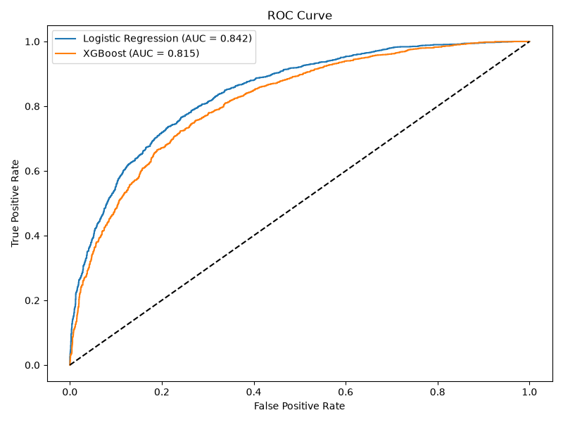
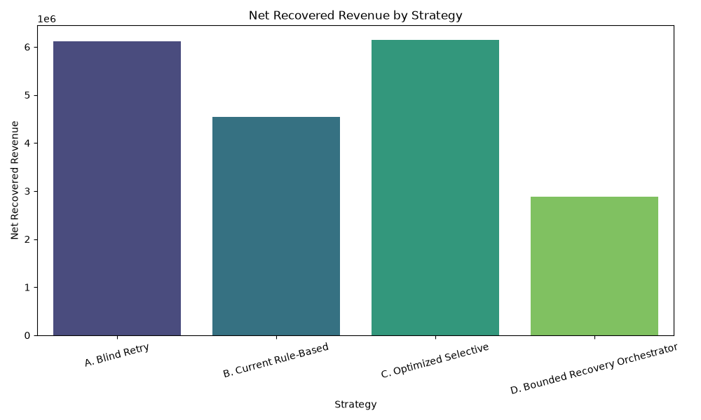
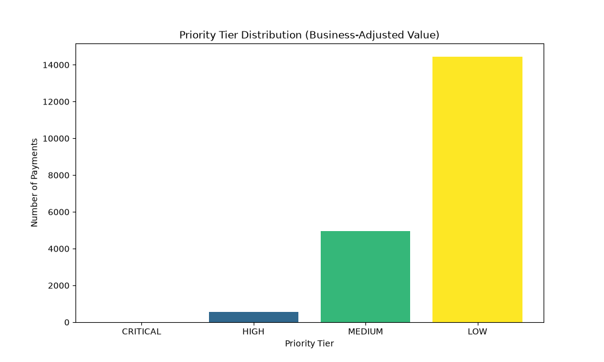
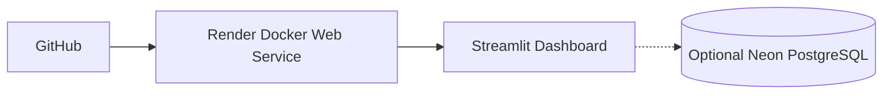

<div align="center">

# AI Revenue Recovery Engine

<p><b>Predicting failed-payment recovery probability, selecting economically viable recovery actions, and prioritizing the highest-value recovery opportunities.</b></p>
<p>Razorpay AI Builder Challenge<br>Track 03 — AI Revenue Recovery · 2026</p>

<br>


<br><br>

<table align="center" width="85%">
  <tr>
    <td align="center">
      <h2>Live Dashboard</h2>
      <p>
        Real-time recovery intelligence dashboard with prediction, economic strategy simulation,<br>bounded recovery decisions, prioritization, monitoring and auditability.
      </p>
      <br>
      <a href="https://ai-revenue-recovery-mbac.onrender.com">
        
      </a>
      <br><br>
      <code>ai-revenue-recovery-mbac.onrender.com</code>
    </td>
  </tr>
</table>

<br>

<sub><em>Synthetic-data demonstration. Recovery outcomes, action costs, and recovery multipliers are simulated assumptions. No real Razorpay customer/payment data is used and no live payment execution occurs.</em></sub>

</div>

---

## 📑 Table of Contents

<table width="100%">
<tr>
<td valign="top">
1. <a href="#1-overview">Overview</a><br>
2. <a href="#2-why-this-approach">Why This Approach</a><br>
3. <a href="#3-architecture">Architecture</a><br>
4. <a href="#4-end-to-end-recovery-pipeline">End-to-End Recovery Pipeline</a><br>
5. <a href="#5-key-capabilities">Key Capabilities</a><br>
6. <a href="#6-model-evaluation">Model Evaluation</a>
</td>
<td valign="top">
7. <a href="#7-recovery-strategy-benchmark">Recovery Strategy Benchmark</a><br>
8. <a href="#8-bounded-recovery-orchestration">Bounded Recovery Orchestration</a><br>
9. <a href="#9-business-adjusted-prioritization">Business-Adjusted Prioritization</a><br>
10. <a href="#10-dashboard">Dashboard</a><br>
11. <a href="#11-visual-results">Visual Results</a><br>
12. <a href="#12-project-structure">Project Structure</a>
</td>
<td valign="top">
13. <a href="#13-quick-start">Quick Start</a><br>
14. <a href="#14-deployment">Deployment</a><br>
15. <a href="#15-limitations">Limitations</a><br>
16. <a href="#16-future-enhancements">Future Enhancements</a><br>
17. <a href="#17-author">Author</a>
</td>
</tr>
</table>

---

## 1. Overview

AI Revenue Recovery Engine is an end-to-end machine-learning and decisioning system designed to recover revenue from failed digital payments more intelligently.

Instead of blindly retrying every failed payment, the system:
- **✓** Predicts recovery probability
- **✓** Estimates expected recovery value
- **✓** Evaluates action economics
- **✓** Applies bounded recovery guardrails
- **✓** Prioritizes high-value recovery opportunities
- **✓** Simulates outcomes
- **✓** Monitors distribution drift
- **✓** Maintains an audit trail
- **✓** Optionally persists decisions in PostgreSQL

**Core idea:**  
`FAILED PAYMENT` → `PREDICT` → `ECONOMIC DECISION` → `BOUNDED ACTION` → `PRIORITIZE` → `VERIFY`

---

## 2. Why This Approach?

This is not only a classifier. It is a robust recovery decision system.

| Typical Approach | AI Revenue Recovery Engine |
|---|---|
| Detect failed payment | Detect + validate inputs |
| Retry blindly | Predict recovery probability |
| Fixed retry rules | Cost-aware strategy selection |
| Probability only | Probability + expected recovery value |
| Unlimited retry risk | Bounded recovery guardrails |
| Same priority for every payment | Business-adjusted recovery queue |
| Individual prediction only | 20K-payment strategy benchmark |
| No operational history | Audit trail + persistence |
| No monitoring | PSI drift monitoring |

---

## 3. Architecture


*(Note: System orchestrates offline simulations. No live execution API is provided).*

---

## 4. End-to-End Recovery Pipeline

### 01 — DETECT
Failed payment enters the system and inference inputs are strictly validated.

### 02 — PREDICT
The calibrated ML model estimates the probability of eventual recovery.

### 03 — DECIDE
Expected recovery is compared with action economics and bounded policy constraints.

### 04 — PRIORITIZE
Business-adjusted expected recovery determines queue order.

### 05 — VERIFY
Outcomes are simulated, decisions are audited, and distributions can be monitored for drift.

> **Note:** Prioritization controls queue order. The bounded recovery policy controls whether an action is allowed.

---

## 5. Key Capabilities

<table width="100%">
<tr>
<td width="50%" valign="top">
<b>Recovery Prediction</b><br>
Calibrated ML probability estimation.
<br><br>
<b>Cost-Aware Strategy Optimization</b><br>
Compares recovery value against action cost and evaluates threshold sensitivity.
<br><br>
<b>Explainable Decision Trace</b><br>
Separates model estimate, economic estimate, policy decision and business priority.
<br><br>
<b>Input Validation</b><br>
Rejects invalid inference inputs before ML execution.
<br><br>
<b>Bounded Recovery Orchestration</b><br>
Enforces probability, economic viability and maximum-attempt stopping rules.
</td>
<td width="50%" valign="top">
<b>Business-Adjusted Prioritization</b><br>
Ranks recovery opportunities using expected recovery value and subscription business context.
<br><br>
<b>Closed-Loop Outcome Simulation</b><br>
Simulates action outcomes and net recovered revenue.
<br><br>
<b>PSI Drift Monitoring</b><br>
Uses PSI-based monitoring and synthetic drift scenarios.
<br><br>
<b>Audit Trail & Persistence</b><br>
Records recovery decisions and metadata, with optional PostgreSQL persistence.
<br><br>
<b>Docker Deployment</b><br>
Containerized production-style prototype deployment.
</td>
</tr>
</table>

---

## 6. Model Evaluation

| Metric | Uncalibrated LR | Calibrated LR |
|---|---:|---:|
| **Accuracy** | 0.7588 ± 0.0038 | 0.7628 ± 0.0031 |
| **Precision** | 0.7041 ± 0.0067 | 0.7391 ± 0.0083 |
| **Recall** | 0.7590 ± 0.0116 | 0.6945 ± 0.0222 |
| **F1** | 0.7304 ± 0.0046 | 0.7159 ± 0.0088 |
| **ROC-AUC** | 0.8401 ± 0.0027 | 0.8400 ± 0.0027 |
| **PR-AUC** | 0.8020 ± 0.0065 | 0.7989 ± 0.0067 |
| **Brier** | 0.1631 ± 0.0011 | 0.1608 ± 0.0015 |

Isotonic calibration was retained because the Brier score improved from 0.1631 to 0.1608.

*All evaluation results are based on the synthetic dataset.*

<div align="center">
  
  <br/>
  <sub>Model evaluation (ROC-AUC) on the synthetic recovery dataset.</sub>
</div>

---

## 7. Recovery Strategy Benchmark

The same synthetic 20,000-payment batch was evaluated across four methodologies:
- **A** — Blind Retry
- **B** — Current Rule-Based
- **C** — Optimized Selective
- **D** — Bounded Recovery Orchestrator

| Strategy | Net Recovered Revenue | ROI |
|---|---:|---:|
| **Blind Retry** | ≈ ₹6.11M | 6.11x |
| **Rule-Based** | ≈ ₹4.53M | 16.21x |
| **Optimized Selective** | ≈ ₹6.14M | 6.63x |
| **Bounded Orchestrator** | ≈ ₹2.87M | 15.82x |

<div align="center">
  
  <br/>
  <sub>Simulated Net Recovered Revenue across the four recovery strategies.</sub>
</div>
<br>

> The benchmark highlights the trade-off between maximizing absolute recovery and maximizing economic efficiency under operational constraints. The bounded orchestrator intentionally enforces stronger stopping behavior.

---

## 8. Bounded Recovery Orchestration

The system controls execution via a rigorous state machine:  
`FAILED` → `ASSESSED` → `ACTION SELECTED` → `ACTION EXECUTED` → `RECOVERED / FAILED_RECOVERY` → `VERIFIED` → `CLOSED / STOPPED`

**Synthetic benchmark results (Verified guardrails):**
- **Configured maximum automatic attempts:** 2
- **Probability stopping:** 347
- **Economic viability stopping:** 1,226
- **Maximum-attempt stopping:** 9,925
- **Manual review:** 0
- **Invalid state transitions:** 0

---

## 9. Business-Adjusted Prioritization

Prioritization directs operational attention by scaling expected recovery with business context.

**Formula:**
```text
base_expected_recovery = recovery_probability × payment_amount
business_adjusted_expected_recovery = base_expected_recovery × subscription_multiplier
```
*(subscription multiplier: 1.5 for subscriptions, 1.0 otherwise)*

**Priority Tiers:**
- **CRITICAL**: ≥ ₹10,000
- **HIGH**: ≥ ₹2,500
- **MEDIUM**: ≥ ₹500
- **LOW**: < ₹500

**Verified Distribution:**
- CRITICAL — 16
- HIGH — 571
- MEDIUM — 4,972
- LOW — 14,441

**Verified Concentration:**
- **Top 1%** → 12.4%
- **Top 5%** → 33.4%
- **Top 10%** → 48.3%
- **Top 20%** → 66.3%

*On the synthetic benchmark, the top 10% of prioritized payments represented 48.3% of total business-adjusted expected recovery value.*

<div align="center">
  <br>
  
  <br/>
  <sub>Distribution of priority tiers across the synthetic failed payments.</sub>
</div>

---

## 10. Dashboard

The interactive Streamlit dashboard is separated into 9 functional tabs reflecting the complete lifecycle of the recovery orchestration prototype.

**Primary Demo Flow:**
The system is best demonstrated via the **Real-Time Inference** tab:  
`Real-Time Inference` → `Recovery Probability` → `Expected Recovery` → `Policy Decision` → `Economic Estimate` → `Business Priority` → `Decision Explanation` → `Bounded Recovery Workflow`

**All Tabs:**
1. Real-Time Inference
2. Recovery Prioritization
3. Recovery Benchmark
4. Strategy Simulator
5. Batch Analysis
6. Outcome Simulation
7. Drift Monitoring
8. Audit Trail
9. Database Status

---

## 11. Visual Results

<div align="center">
  
  
  <br>
  <sub>Left: Isotonic Calibration Curve. Right: Threshold vs ROI Sensitivity Analysis.</sub>
</div>

---

## 12. Project Structure

```text
.
├── app/                           # Presentation Layer (Streamlit Dashboard)
├── data/                          # Synthetic Datasets
├── docker/                        # Deployment configuration
├── docs/                          # Architecture documentation
├── models/                        # Serialized ML artifacts
├── notebooks/                     # Exploratory Data Analysis
├── reports/                       # Generated analysis and plots
├── scripts/                       # Utility/maintenance scripts
├── src/                           # Core Engine
│   ├── domain/                    # Business rules (Recovery Engine, Policy, Prioritization)
│   ├── infrastructure/            # Persistence (PostgreSQL, Database config)
│   ├── ml/                        # Machine learning (Training, Evaluation, Benchmarks)
│   ├── services/                  # Application services (Inference, Audit, Monitoring)
│   └── validation/                # Input validation logic
└── tests/                         # Pytest test suite
```

---

## 13. Quick Start

**1. Clone & Setup**
```bash
git clone https://ai-revenue-recovery-mbac.onrender.com
cd AI-Revenue-Recovery
python3 -m venv .venv
source .venv/bin/activate
pip install -r requirements.txt
```

**2. Run Test Suite (127 Tests)**
```bash
PYTHONPATH=. pytest -q
```

**3. Launch Dashboard**
```bash
streamlit run app/streamlit_app.py
```
*(Optional: Provide a `DATABASE_URL` in `.env` for PostgreSQL persistence).*

---

## 14. Deployment



- `DATABASE_URL` is securely supplied via environment variables in Render.

---

## 15. Limitations
- Synthetic dataset
- Simulated recovery outcomes
- Simulated action costs and recovery multipliers
- No real Razorpay payment execution
- No real customer/payment data
- Probabilities are estimates, not guarantees
- Business prioritization is queue ordering, not action authorization
- PostgreSQL persistence is optional

---

## 16. Future Enhancements
*Note: The following items represent proposed future integration work, not currently implemented features.*
- Real Razorpay webhook/payment integration
- Real recovery execution
- Online outcome feedback
- Richer customer communication
- Production telemetry
- Merchant-configurable recovery policies

---

## 17. Author
**Razorpay AI Buildathon 2026 Submission**
