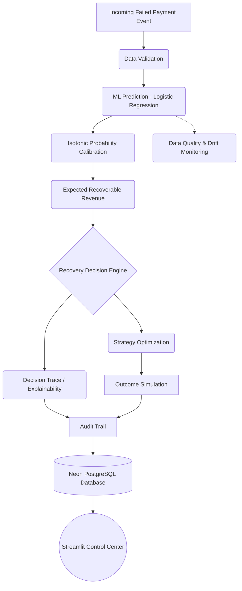
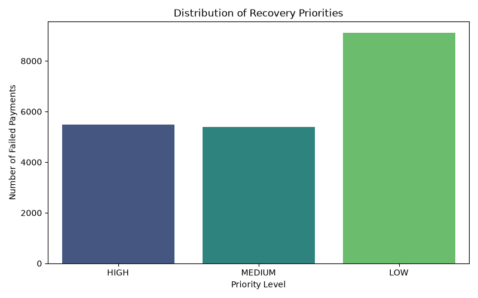
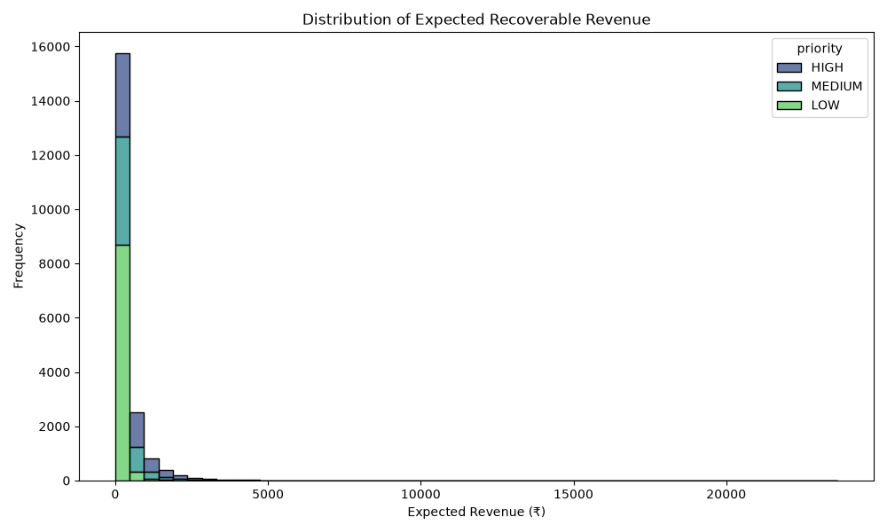
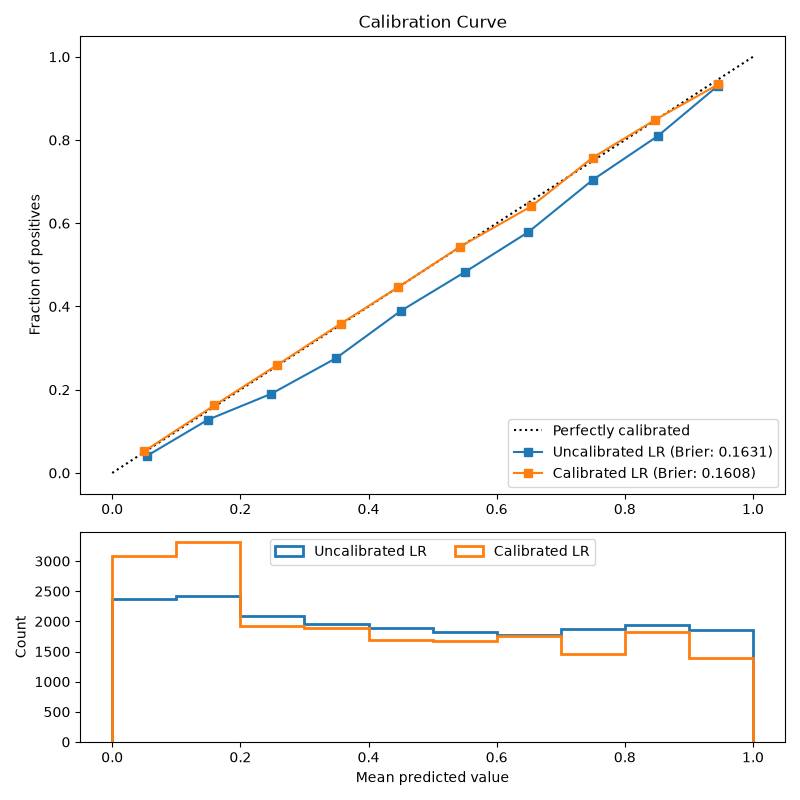
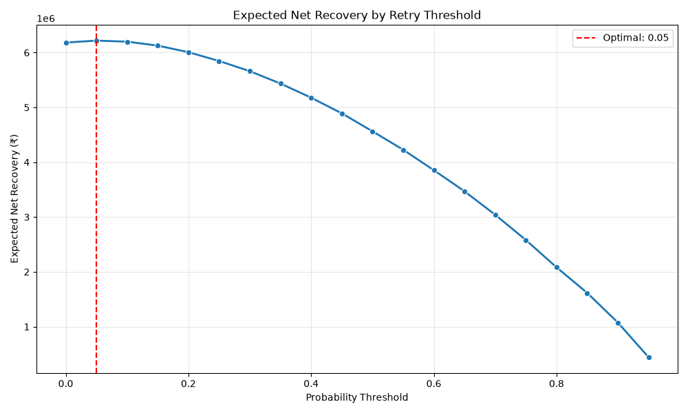
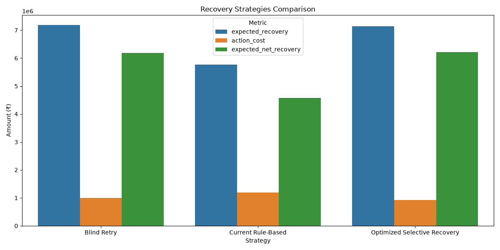
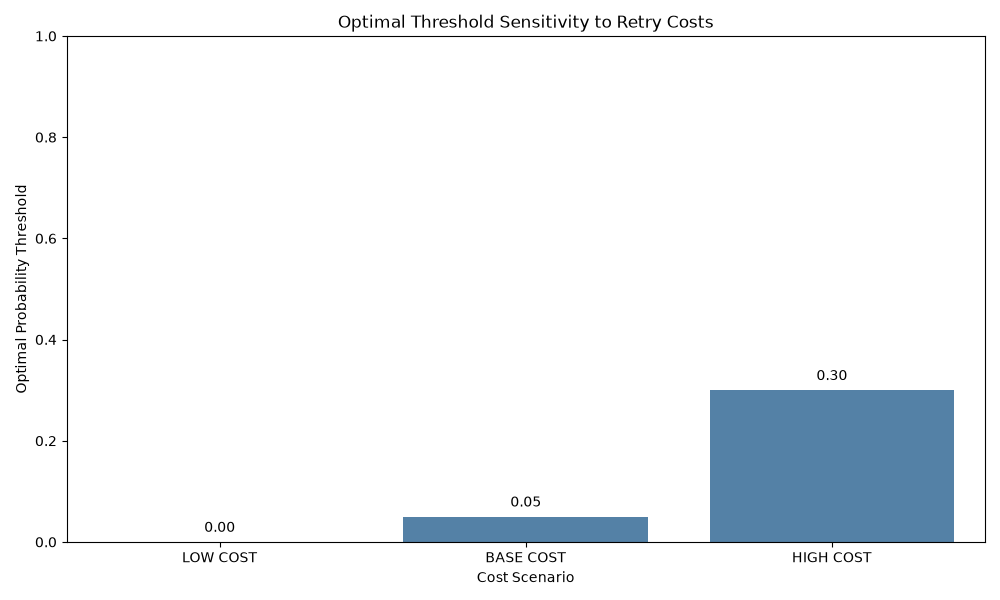

<div align="center">
  

  # AI Revenue Recovery Engine

  **Track 03 — AI Revenue Recovery | Razorpay AI Buildathon 2026**

  *An intelligent, cost-aware machine learning engine to optimize failed payment recovery.*

  [](https://python.org)
  [](https://neon.tech)
  [](https://streamlit.io)
  []()
  []()
</div>

<br />

## Table of Contents
1. [Overview](#1-overview)
2. [Problem](#2-problem)
3. [Solution](#3-solution)
4. [Architecture](#4-architecture)
5. [Recovery Decision Flow](#5-recovery-decision-flow)
6. [Model Evaluation](#6-model-evaluation)
7. [Economic Optimization](#7-economic-optimization)
8. [Explainability](#8-explainability)
9. [Monitoring](#9-monitoring)
10. [Closed-Loop Outcome Simulation](#10-closed-loop-outcome-simulation)
11. [Audit Trail](#11-audit-trail)
12. [Real-Time Inference](#12-real-time-inference)
13. [PostgreSQL / Neon](#13-postgresql--neon)
14. [Dashboard](#14-dashboard)
15. [Project Structure](#15-project-structure)
16. [Quick Start](#16-quick-start)
17. [Environment Variables](#17-environment-variables)
18. [Testing](#18-testing)
19. [Limitations & Assumptions](#19-limitations--assumptions)
20. [Implementation Status](#20-implementation-status)
21. [Tech Stack](#21-tech-stack)
22. [Deployment](#22-deployment)
23. [Author](#23-author)

---

## 1. Overview
The **AI Revenue Recovery Engine** is a comprehensive machine learning and decisioning pipeline designed to tackle the challenge of failed digital payments. Instead of relying on static retry schedules, this engine uses historical telemetry to predict the probability of recovery, calibrates that probability, and makes cost-aware retry decisions designed to maximize net revenue while minimizing unnecessary customer friction.

## 2. Problem
Failed payments directly translate to **revenue at risk** for merchants. However, blindly retrying every failed payment is inefficient:
- **Direct Costs:** Each payment gateway retry incurs a small fee.
- **Customer Friction:** Repeated failed charges can trigger bank freezes or frustrate customers.
- **Resource Allocation:** Time spent retrying hopeless payments (e.g., permanently closed accounts) is wasted.

Recovery decisions must intelligently weigh the **probability of success**, the **payment amount**, historical customer behavior, and the underlying context of the failure to optimize the recovery effort.

## 3. Solution
This project implements a fully integrated pipeline that moves beyond pure probability prediction to economic decision-making:
- **Probability Prediction:** A Logistic Regression model predicting the likelihood of recovery.
- **Calibrated Probabilities:** Isotonic calibration ensures predictions represent true mathematical probabilities.
- **Expected Recoverable Revenue:** Combining probability with the transaction amount to prioritize high-value efforts.
- **Rule-Based Decision Routing:** Classifying actions (Retry, Reminder, Manual Review).
- **Cost-Aware Threshold Optimization:** Evaluating strategies to find the perfect economic balance between retry costs and recovered revenue.
- **Outcome Simulation:** Generating synthetic outcomes to measure strategy performance.
- **Auditability & Traceability:** Explaining *why* a decision was made and recording it securely.
- **Monitoring:** Detecting data drift to maintain model integrity.
- **Persistent Storage:** Storing decisions and audits reliably via PostgreSQL.

---

## 4. Architecture



---

## 5. Recovery Decision Flow
The system applies logical boundaries to raw probabilities. The baseline rule-based boundaries (Stage 5) determine the recommended action:

- **HIGH (Probability >= 0.65)** ➔ `Retry Payment` (Silent background retry)
- **MEDIUM (Probability 0.35 - 0.64)** ➔ `Payment Method Reminder` (Email/SMS to customer)
- **LOW (Probability < 0.35)** ➔ `Manual Review / Stop Automatic Retry` (Suspend subscription)

*Note: The Stage 5 rule-based decision boundaries above are structurally distinct from the Stage 8 Economic Optimization thresholds, which dynamically sweep across probabilities based on explicit simulated cost assumptions.*

<div align="center">
  
  <br>
  
</div>

---

## 6. Model Evaluation
The engine utilizes a **Logistic Regression** model trained and evaluated using 5-fold Stratified K-Fold cross-validation on a **synthetic dataset**.

**Calibration:** To ensure predicted probabilities map directly to real-world likelihoods, we applied Isotonic Calibration.

### Key Metrics (Mean ± Std)
| Metric | Uncalibrated LR | Calibrated LR |
|:---|:---|:---|
| **Accuracy** | 0.7588 ± 0.0038 | 0.7628 ± 0.0031 |
| **Precision** | 0.7041 ± 0.0067 | 0.7391 ± 0.0083 |
| **Recall** | 0.7590 ± 0.0116 | 0.6945 ± 0.0222 |
| **ROC-AUC** | 0.8401 ± 0.0027 | 0.8400 ± 0.0027 |
| **Brier Score** | 0.1631 ± 0.0011 | 0.1608 ± 0.0015 |

*Interpretation:* The baseline Logistic Regression model is inherently well-calibrated for this dataset. Isotonic calibration provided a marginal improvement to the Brier Score, making the outputs highly reliable for expected-value financial calculations.

<div align="center">
  
</div>

---

## 7. Economic Optimization
Instead of relying on arbitrary probability thresholds, the engine sweeps through all potential thresholds to maximize net revenue based on explicit economic assumptions.

**Synthetic Simulation Assumptions:**
- `retry_cost`: ₹5.00 (gateway fee)
- `customer_friction_cost`: ₹45.00 (implicit cost of annoying customer)
- **Effective Retry Cost**: ₹50.00
- `reminder_cost`: ₹1.00 (email/SMS)
- `manual_review_cost`: ₹100.00 (human agent time)
- `retry_multiplier`: 1.0 (baseline)
- `reminder_multiplier`: 0.50 (reminders are less effective than direct retries)
- `manual_review_multiplier`: 0.75 (human intervention success rate)

### Strategy Comparison
- **Strategy A (Blind Retry):** Retry every single failed payment regardless of probability. Action Cost applies to every payment.
- **Strategy B (Current Rule-Based):** Stage 5 logic (>= 0.65 Retry, 0.35 - 0.64 Reminder, < 0.35 Manual Review). Action costs and specific recovery multipliers apply based on probability bands.
- **Strategy C (Optimized Selective):** Sweeps thresholds to find the exact probability cutoff that maximizes Expected Net Recovery. Only retries payments >= threshold, doing nothing below threshold.

<div align="center">
  
  
  <br>
  
</div>

---

## 8. Explainability
Financial decisioning must be transparent. The `DecisionTracer` module provides explicit, deterministic traces for every prediction, detailing:
- The predicted model probability.
- The calculated expected recovery value.
- Hypothetical retry economics (expected net value).
- The selected action and priority.
- A human-readable `decision_reason` (e.g., *"Retry Payment selected due to high probability (0.75) and sufficient expected recovery (₹450.00)."*).
- Key input factors driving the decision.

*Note: This traceability relies on the logic and mathematical boundaries of the engine, not on causal SHAP algorithms.*

---

## 9. Monitoring
To prevent silent model degradation, the `monitoring.py` module evaluates ongoing data streams against the original training baseline.
- **Data Quality:** Missing value checks and type validation.
- **Population Stability Index (PSI):** Tracks distributional drift in predictions.
- **Feature Drift:** Monitors numeric bounds and categorical shifts.
- **Alert Levels:** Gracefully escalates from NORMAL to WARNING to DRIFT based on deviation magnitude.

---

## 10. Closed-Loop Outcome Simulation
To prove the efficacy of the strategies, `OutcomeSimulator` applies Monte Carlo techniques to resolve the payment states based on the recommended actions. This synthetic simulation creates a closed loop, proving exactly how the economic assumptions translate into final recovered revenue across Strategies A, B, and C. *(All outcomes are synthetic simulation results.)*

---

## 11. Audit Trail
Accountability is critical. The `AuditTrail` module writes every decision, input factor, timestamp, and simulated outcome to a secure, flat schema.

This data powers the **Audit Trail** tab in the dashboard, enabling human-in-the-loop review. *(The audit history is based on locally generated synthetic artifacts and does not represent live production events).*

---

## 12. Real-Time Inference
The `RecoveryInferenceService` orchestrates the entire pipeline for single-event processing.
- Orchestrates Input Validation ➔ ML Prediction ➔ Decision ➔ Explanation ➔ Audit.
- Exposes processing metadata (timestamps, latency, model version).
- Gracefully degrades to a stateless mode if the backend database is unavailable.
- Safely catches exceptions and exposes generic public error messages while preventing raw stack traces.

---

## 13. PostgreSQL / Neon
The application features a robust persistence layer designed for **Neon PostgreSQL**.
- **Five-Table Architecture:** `model_versions`, `payment_events`, `recovery_decisions`, `audit_records`, and `recovery_outcomes`.
- **Idempotency:** Secure uniqueness checks via `idempotency_key` prevent duplicate machine learning inference runs.
- **Security:** Requires `sslmode=require`. Connection strings are injected strictly via `.env` (`DATABASE_URL`).
- **Flexibility:** Falls back seamlessly to local Docker PostgreSQL if desired, or operates completely stateless if no database is provided.

---

## 14. Dashboard
The **Streamlit Control Center** (`app/streamlit_app.py`) provides an interactive window into the entire pipeline.

**Available Tabs:**
1. `Single Payment Simulation`
2. `Batch Recovery Analysis`
3. `Strategy Simulator`
4. `Monitoring`
5. `Outcome Simulation`
6. `Audit Trail`
7. `Real-Time Inference Demo`
8. `PostgreSQL Status`

---

## 15. Project Structure
```text
.
├── app/
│   └── streamlit_app.py           # Streamlit Dashboard
├── data/                          # Datasets
├── docs/                          # Architecture documentation
├── models/                        # Serialized ML artifacts
├── src/                           # Core Engine Modules
│   ├── audit_trail.py
│   ├── data_validator.py
│   ├── database.py
│   ├── db_persistence.py
│   ├── decision_trace.py
│   ├── generate_dataset.py
│   ├── inference_service.py
│   ├── monitoring.py
│   ├── outcome_simulator.py
│   ├── recovery_engine.py
│   ├── recovery_strategy.py
│   ├── robust_evaluation.py
│   └── train_model.py
├── tests/                         # Pytest test suite
├── .env.example                   # Environment variables template
├── docker-compose.yml             # Optional Local Postgres
├── requirements.txt               # Dependencies
└── README.md
```

---

## 16. Quick Start

**1. Clone & Setup Virtual Environment**
```bash
git clone https://github.com/allknowledge34/AI-Revenue-Recovery.git
cd AI-Revenue-Recovery
python3 -m venv .venv
source .venv/bin/activate
```

**2. Install Dependencies**
```bash
pip install -r requirements.txt
```

**3. Configure Environment (Optional but Recommended)**
```bash
cp .env.example .env
# Edit .env and insert your Neon DATABASE_URL
```

**4. Run Tests**
```bash
PYTHONPATH=. pytest -q
```

**5. Launch Dashboard**
```bash
streamlit run app/streamlit_app.py
```

---

## 17. Environment Variables
The application utilizes the following variables via a `.env` file (never committed):
- `DATABASE_URL`: The PostgreSQL connection string (Neon or local Docker).
- `MODEL_VERSION`: Logical version string for the active model (e.g., `v1.0`).
- `TEST_DATABASE_URL`: Isolated database used purely for `pytest` integration tests.

---

## 18. Testing
The repository maintains strict test coverage ensuring algorithmic and architectural integrity.
**Current Status:** `90 passed, 6 skipped in ~16s`
*(Integration tests correctly skip gracefully if `TEST_DATABASE_URL` is unconfigured to protect production databases).*

---

## 19. Limitations & Assumptions
- **Synthetic Dataset:** All models, distributions, and calibrations are based on synthetically generated data mapping to mathematical assumptions, not real-world merchant telemetry.
- **Simulated Outcomes:** All recovery revenues and economic costs are simulated assumptions, not actual financial guarantees.
- **No Real Execution:** The system is an intelligence/decisioning demonstration and does **not** execute actual Razorpay payment gateway API calls.
- **Idempotency Fallback:** If `idempotency_key` is not supplied, the system falls back to a request-scoped UUID, which guarantees insertion but sacrifices true cross-request idempotency.
- **Distributed Infrastructure:** While PostgreSQL provides robust persistence, this repository lacks the message brokers (Kafka/RabbitMQ) required for high-throughput, distributed event-driven production workloads.

---

## 20. Implementation Status

| Feature | Status |
| :--- | :---: |
| Synthetic Dataset Generation |  Completed |
| Logistic Regression Model Training |  Completed |
| Isotonic Probability Calibration |  Completed |
| Rule-Based Decision Routing |  Completed |
| Strategy Simulator & Economic Optimization |  Completed |
| Decision Tracer (Explainability) |  Completed |
| Closed-Loop Outcome Simulation |  Completed |
| Data & Prediction Drift Monitoring |  Completed |
| Persistent Audit Trail |  Completed |
| Real-Time Inference Service |  Completed |
| Neon PostgreSQL Persistence Layer |  Completed |
| Streamlit Interactive Dashboard |  Completed |

---

## 21. Tech Stack
- **Core:** Python 3.13.7
- **Data & ML:** Pandas, NumPy, Scikit-Learn
- **Visualization:** Matplotlib, Seaborn, Streamlit
- **Database:** Neon PostgreSQL (via `psycopg` binary)
- **Testing:** Pytest

---

## 22. Deployment
The application is fully container-ready via `docker-compose` (for the database layer) and can easily be deployed to platforms like **Render**, **Heroku**, or **Streamlit Community Cloud**.
*(Currently, this repository is configured for local demonstration; no live URL is officially maintained).*

---

## 23. Author
**Razorpay AI Buildathon 2026 Submission**
